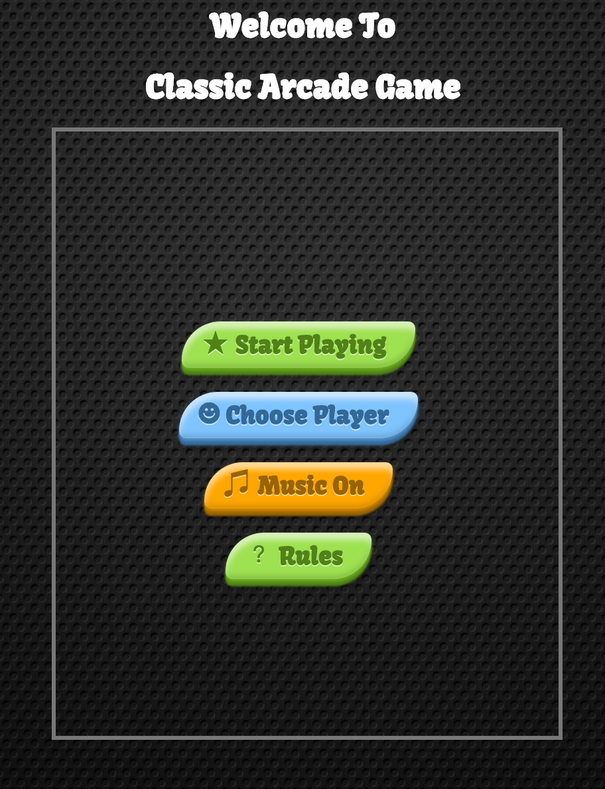

# Classic Arcade Game

* Clone the program and make sure you have all these directories and main files:
    * HTML files: index.html, player.html, game.html, win.html and gameOver.html .
    * Directories: js, css, images and sounds.
* Once you have all files, click on index.html to start the game screen. 

## Here is the start screen:

* Start Playing: allows you to start playing with the default character (little boy). 
* Choose Player: allows you to choose one of the four characters and start playing or going back to the start screen.
* Music On/Off: allows you to mute the introduction music and replay it again. 
* Rules: shows you the game rules and describes button functions. 

## Here is the player choices screen:

* Click on a character, when you see the border has drawn around the character that means you have chosen it. 
* Play: allows you to start playing with the character you just chose. 
* Back: allows you to go back to start screen. Note: If you go back to start screen, your choice will be dismissed. 
* Music On/Off: allows you to mute the introduction music and replay it again. 

## Here is the game app screen:

* Home: is a button that allows you to go back to start screen.
* Scores: shows you current score (starting with 0), if you reach the water without hitting the bugs your score will be increased by 1. 
* Timer: the timer starts with 60 seconds and when it reaches 0 means Time is out ! You either win or lose. 
	

## How does the game work?

The game consists of bugs and a character. Bugs are moving with a random speed. The target is moving the character to the water without hitting bugs. If the character hits the bug and the score greater than 0, the score would be decreased by one and the character returns back to its starting point. If the character reaches the water safely, the score will be increased by one and the character returns back to its starting point. 
	
* Win:
	* When time is out (0 seconds) and the score equal to or greater than (10).
	* The winning screen will show "Congratulations" and allows you to play again. 
* Lose:
	* When time is out and the score less than 10.
	* The lose screen will show "Game Over" and allows you to retry.

Hop you enjoy playing my game.  
		 